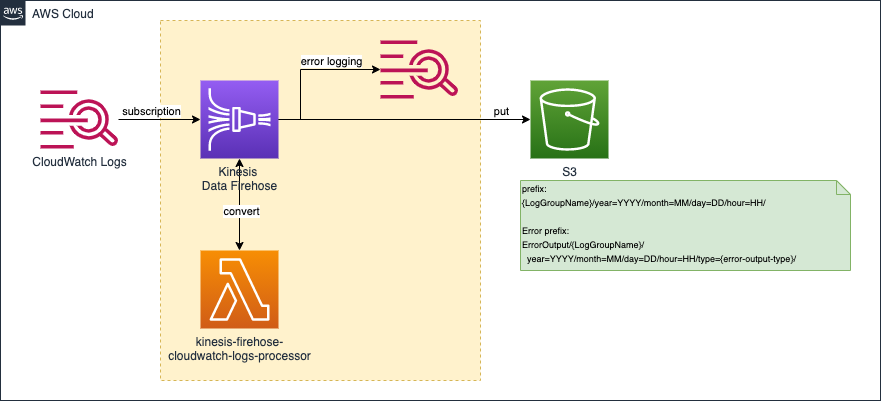

# terraform-aws-cloudwatch-logs-to-s3

A Terraform template that transfers CloudWatch Logs to S3.  
Output to S3 in Hive format for Athena.

* Set the Subscription Filter for the existing LogGroup.
* Use Kinesis Firehose to output to an existing S3 bucket in GZIP format.

## Overview

## Requirements

| Name | Version |
|------|---------|
| terraform | ~> 0.13 |
| archive | ~> 2.0.0 |
| aws | ~> 3.12 |

## Providers

| Name | Version |
|------|---------|
| archive | ~> 2.0.0 |
| aws | ~> 3.12 |

## Inputs

| Name | Description | Type | Default | Required |
|------|-------------|------|---------|:--------:|
| aws\_region | AWS Region | `string` | n/a | yes |
| aws\_s3\_bucket\_name | Destination S3 bucket | `string` | n/a | yes |
| name | name assign to resources. | `string` | `"cwl2s3"` | no |
| prefix | (Optional) Specified prefix assign to resources. | `string` | `""` | no |
| src\_dir | Lambda Function source directory for transform source records. (specify a relative path to ./src) | `string` | n/a | yes |
| subscription\_filter\_firehose\_log\_group\_retention\_in\_days | (Optional) Kinesis Firehose error logging retention in days. | `number` | `60` | no |
| subscription\_filter\_processor\_log\_group\_retention\_in\_days | (Optional) Lambda Function logging retention in days. | `number` | `60` | no |
| subscription\_filter\_processor\_memory\_size | (Optional) Lambda Function memory size(MB). | `number` | `128` | no |
| subscription\_filter\_processor\_timeout | (Optional) Lambda Function timeout seconds. | `number` | `60` | no |
| subscription\_filters | CloudWatch Logs Subscription Filters.  The Key is the name of the delivery stream, and the "{prefix}{name}-" is added. For example, if you specify "myloggroup" as Key, the delivery stream name will be "{prefix}{name}-myloggroup".  [CloudWatch Log] log\_group\_name = Log group name filter\_pattern = Subscription filter pattern ("" matches all log events)  [Firehose] buffer\_interval           = S3 buffer conditions interval(secounds). Default 300 buffer\_size               = S3 buffer conditions size(MiB). Default 5 processor\_buffer\_interval = Lambda buffer interval(secounds). Default 60 processor\_buffer\_size     = Lambda buffer conditions size(MiB). Default 3 | <pre>map(object({     log_group_name            = string     filter_pattern            = string     buffer_interval           = number     buffer_size               = number     processor_buffer_interval = number     processor_buffer_size     = number   }))</pre> | n/a | yes |
| tags | (Optional) A mapping of tags to assign to resources. | `map(string)` | `{}` | no |

## Outputs

| Name | Description |
|------|-------------|
| this\_kinesis\_firehose\_delivery\_streams | The name of the Kinesis Firehose Delivery Stream. |
| this\_kinesis\_firehose\_iam\_role\_arn | The ARN of the Kinesis Firehose. |
| this\_processor\_function\_arn | The ARN of the Subscription Processor. |
| this\_subscription\_filter\_iam\_role\_arn | The ARN of the Subscription Filter. |
| this\_subscription\_filters | The name and destination of the Subscription Filter. |

